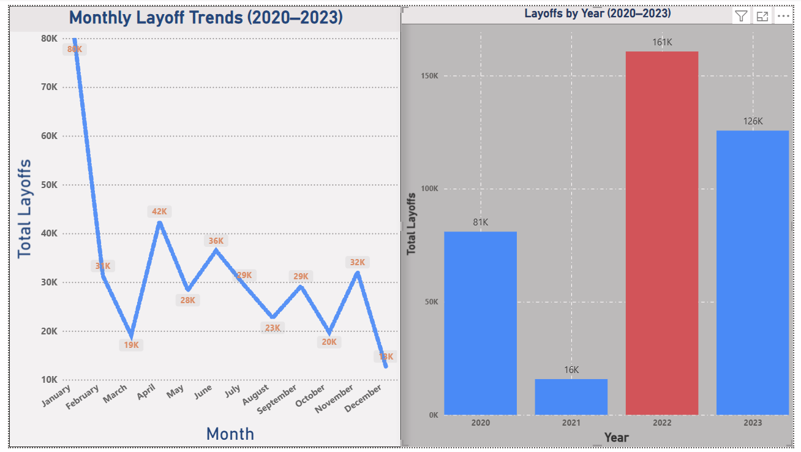
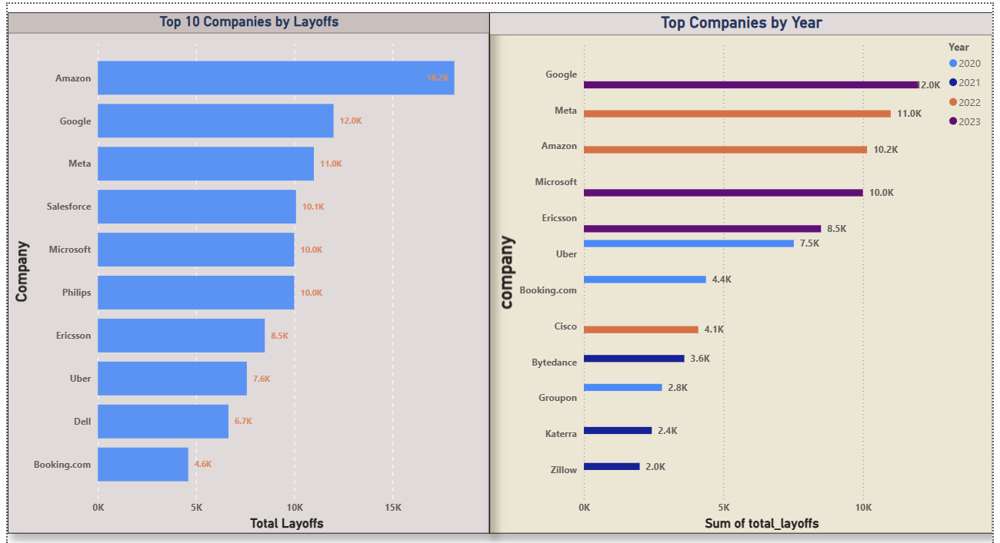
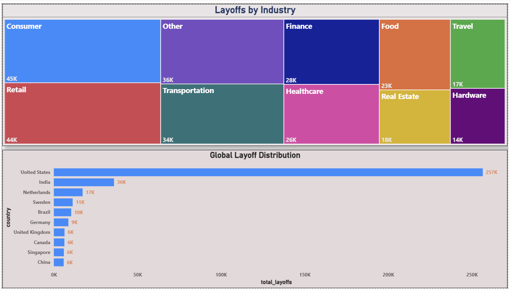
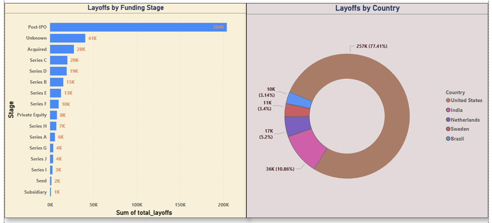

# Global Layoffs Data Analysis (2020-2023)


Comprehensive SQL-driven analysis of global layoffs data (2020-2023) 
revealing industry trends, geographic patterns, and temporal insights 
through advanced data cleaning and exploratory analysis — visualized 
in an interactive Power BI dashboard.

---

## Power BI Dashboard (Updated)

### Overview Page


### Company Analysis


### Industry & Geography


### Details & Funding Stage


> **Bonus — Original Excel Dashboard**
> 
> *Original version built in Excel; rebuilt in Power BI to demonstrate 
> tool proficiency progression from Excel → Power BI.*

---

## Project Overview

This project performs end-to-end SQL analysis on global layoffs data 
spanning 2020-2023, containing **2,362 records** across 9 dimensions. 
Through systematic data cleaning and exploratory analysis, it uncovers 
critical workforce reduction trends across industries, countries, 
and companies — presented through an interactive 4-page Power BI dashboard.

---

## Key Highlights

- **2,362 layoff events** analyzed across 4 years
- **Advanced SQL techniques:** CTEs, Window Functions, Self-JOINs
- **50+ industries** and **30+ countries** covered
- **7 interactive Power BI visualizations** across 4 dashboard pages
- **147+ duplicate records** identified and removed
- **Post-IPO companies** account for 204K+ layoffs (highest risk stage)

---

## Dataset Description

| Attribute | Details |
|---|---|
| Records | 2,362 layoff events |
| Time Period | 2020–2023 |
| Coverage | Global (30+ countries) |
| Industries | 50+ sectors |

**Columns:** company, location, industry, total_laid_off, 
percentage_laid_off, date, stage, country, funds_raised_millions

---

## Technologies Used

- **Database:** MySQL 8.0
- **Visualization:** Microsoft Power BI *(upgraded from Excel)*
- **Techniques:** Data Cleaning, ETL, Exploratory Data Analysis

**Advanced SQL Features:**
- Common Table Expressions (CTEs)
- Window Functions (`ROW_NUMBER()`, `DENSE_RANK()`, `PARTITION BY`)
- Self-JOINs for data enrichment
- Date manipulation (`STR_TO_DATE()`, `YEAR()`, `SUBSTRING()`)
- String functions (`TRIM()`, pattern matching)
- Aggregate functions (`SUM()`, `MAX()`, `AVG()`, `COUNT()`)

---

## SQL Methodology

### Why CTEs?
Used CTEs instead of nested subqueries to improve readability and 
maintainability when ranking companies by layoffs within each year. 
Multi-level CTEs allowed building the analysis step-by-step rather 
than in one complex query.

### Why Self-JOIN?
Used self-JOIN to fill missing `industry` values intelligently. 
If Company A appeared twice and one row had a NULL industry, the 
self-JOIN propagated the known value across — more reliable than 
manual imputation.

### Why ROW_NUMBER() over DISTINCT?
`ROW_NUMBER()` allowed precise duplicate identification on composite 
keys (company + date + total_laid_off) rather than guessing on 
single-column deduplication. This preserved legitimate duplicate 
company names across different dates.

### Why DENSE_RANK() for yearly rankings?
`DENSE_RANK()` handles ties correctly — if two companies had equal 
layoffs in a year, both get the same rank without skipping numbers, 
giving a more accurate "top N per year" result.

---

## Project Structure
```
sql-layoffs-analysis/
│
├── README.md                          # Project documentation
│
├── data/
│   ├── layoffs_data.xlsx              # Raw dataset (2,362 records)
│   └── query_results/                 # Exported CSV files from SQL queries
│       ├── monthly_trends.csv
│       ├── yearly_trends.csv
│       ├── top_10_companies.csv
│       ├── top_companies_by_year.csv
│       ├── industry_breakdown.csv
│       ├── country_breakdown.csv
│       ├── funding_stage_analysis.csv
│       ├── location_hotspots.csv
│       └── complete_shutdowns.csv
│
├── sql/
│   ├── 01_data_cleaning.sql           # Data cleaning & preprocessing
│   └── 02_exploratory_analysis.sql    # EDA queries & insights
│
├── results/
│   ├── key_findings.md                # Executive summary & insights
│   └── query_outputs.md               # Sample query results
│
└── visualizations/
├── Global_Layoffs_Dashboard.pbix  # Power BI dashboard file
├── Overview.png                   # Dashboard overview page
├── company_analysis.png           # Company analysis page
├── industry_geography.png         # Industry & geography page
├── details.png                    # Details & funding stage page
└── excel_dashboard_full.png       # Original Excel dashboard (bonus)

---

## Getting Started

### Prerequisites
- MySQL 8.0 or higher
- MySQL Workbench or any SQL client
- Power BI Desktop (to view .pbix dashboard)

### Setup Instructions

**Step 1: Clone the repository**
```bash
git clone https://github.com/lalimasingh2004-glitch/sql-layoffs-analysis.git
cd sql-layoffs-analysis

```

**Step 2: Import dataset into MySQL**
```sql
CREATE DATABASE world_layoffs_1;
USE world_layoffs_1;
-- Import layoffs_data.xlsx using MySQL Workbench Table Data Import Wizard
```

**Step 3: Run SQL scripts**
```sql
SOURCE sql/01_data_cleaning.sql;
SOURCE sql/02_exploratory_analysis.sql;
```

**Step 4: Open Power BI Dashboard**
- Open `visualizations/Global_Layoffs_Dashboard.pbix` in Power BI Desktop
- All 4 pages load automatically with full interactivity

---

## Dashboard Pages

| Page | Visuals | Key Story |
|---|---|---|
| Overview | Monthly line chart + Yearly column chart | 2022 peak crisis + Q1 seasonality |
| Company Analysis | Top 10 bar + Top by year grouped bar | Amazon leads; Meta dominated 2022 |
| Industry & Geography | Treemap + Country donut | Consumer/Retail = 31% combined |
| Details | Funding stage bar chart | Post-IPO = 204K layoffs (highest risk) |

---

## Key Findings Summary

**Quick Stats**
- Total Layoffs: **383,000+** employees
- Peak Year: **2022** (160,661 layoffs)
- Peak Month: **January** (80K layoffs aggregated)
- Most Affected Sector: **Consumer & Retail** (31% combined)
- Geographic Leader: **United States** (50.8% of global layoffs)
- Highest Risk Stage: **Post-IPO** (204,132 layoffs)

**Critical Insights**
1. **2022 Crisis:** Peak layoff year correlating with tech market corrections and Fed rate hikes
2. **Q1 Seasonality:** January consistently shows highest layoff activity across all years
3. **Big Tech Impact:** Top 10 companies account for 100K+ layoffs
4. **U.S. Concentration:** Over half of global layoffs occurred in United States, led by SF Bay Area
5. **Post-IPO Risk:** Companies that recently went public laid off 2.3x more than Series-stage companies

---

## Analysis Workflow

### Phase 1: Data Cleaning
- Removed **147+ duplicates** using `ROW_NUMBER()` window function
- Standardized company names, industry categories, and country names
- Converted date strings to proper DATE format using `STR_TO_DATE()`
- Filled missing industry values using **self-JOINs**
- Removed records with NULL layoff data

### Phase 2: Exploratory Data Analysis
Answered key business questions:
- Which companies had the most layoffs?
- Which industries were hit hardest?
- What are the geographic patterns?
- How did layoffs trend over time?
- What seasonal patterns exist?
- Which funding stages are most vulnerable?

---

## Business Recommendations

**For HR Leaders & CFOs:**
- Q1 is historically the highest-risk period for layoffs — headcount 
  planning should account for this seasonality
- Post-IPO companies show 2.3x higher layoff frequency — 
  build contingency headcount plans 12 months post-IPO
- Monitor Fed rate announcements as a leading indicator — 
  the November 2022 spike directly correlated with rate hike cycles

**For Job Seekers:**
- U.S. tech roles carry higher volatility — APAC and EU markets 
  showed relatively lower layoff concentration
- Consumer/Retail sector (31% combined impact) carries highest risk — 
  diversify toward B2B SaaS roles
- Avoid joining companies within 12 months of IPO — 
  Post-IPO stage accounts for the most layoffs by far

**For Investors:**
- The November 2022 spike (64K layoffs in one month) correlates 
  with macro policy shifts — use Fed decisions as portfolio risk signals
- Industry diversification is critical — Consumer + Retail = 31% of all layoffs
- Late-stage private companies (Series D+) showed more layoff 
  resilience than Post-IPO public companies

---

## SQL Skills Demonstrated

| Skill | Application |
|---|---|
| Data Cleaning Pipeline | Systematic duplicate removal, standardization |
| Complex CTEs | Multi-level nested queries for yearly rankings |
| Window Functions | `ROW_NUMBER()`, `DENSE_RANK()` for deduplication and ranking |
| Self-JOINs | Intelligent NULL industry value propagation |
| Temporal Analysis | Date manipulation, monthly/yearly trend identification |
| Aggregations | Statistical summaries across all dimensions |

---

## Author

**Lalima Singh**

- Email: lalimasingh2004@gmail.com
- LinkedIn: [Lalima Singh](https://linkedin.com/in/lalima-singh-031431288) 
- GitHub: [@lalimasingh2004-glitch](https://github.com/lalimasingh2004-glitch)

---

*Last Updated: May 2025 | Version: 2.0.0*
*Upgraded: Excel visualizations → Power BI interactive dashboard*

