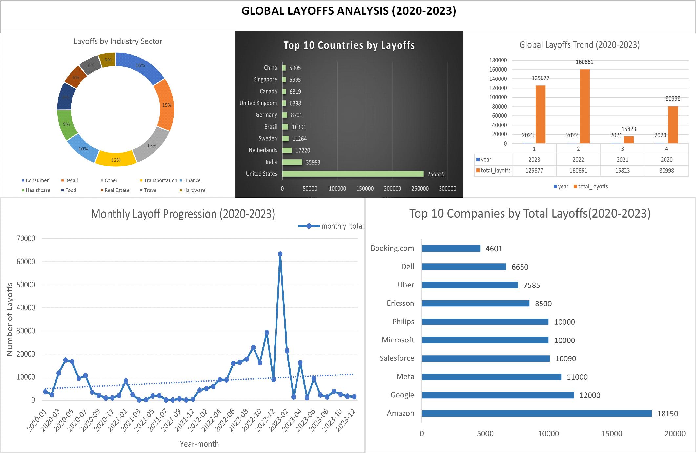
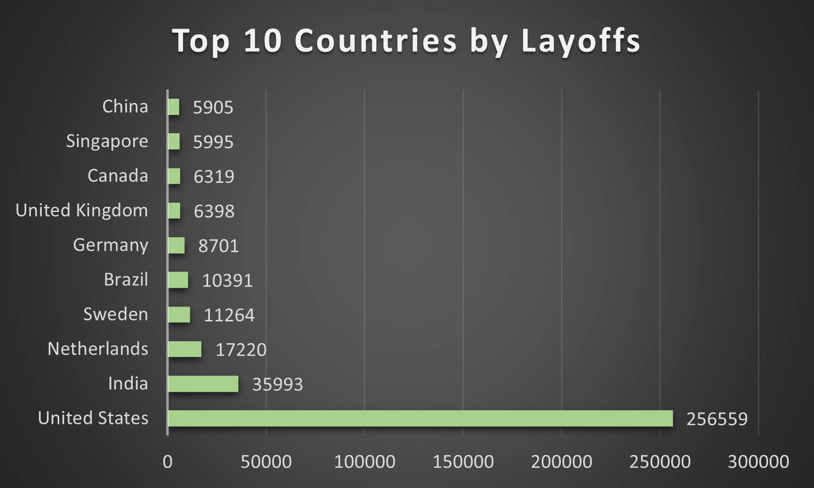
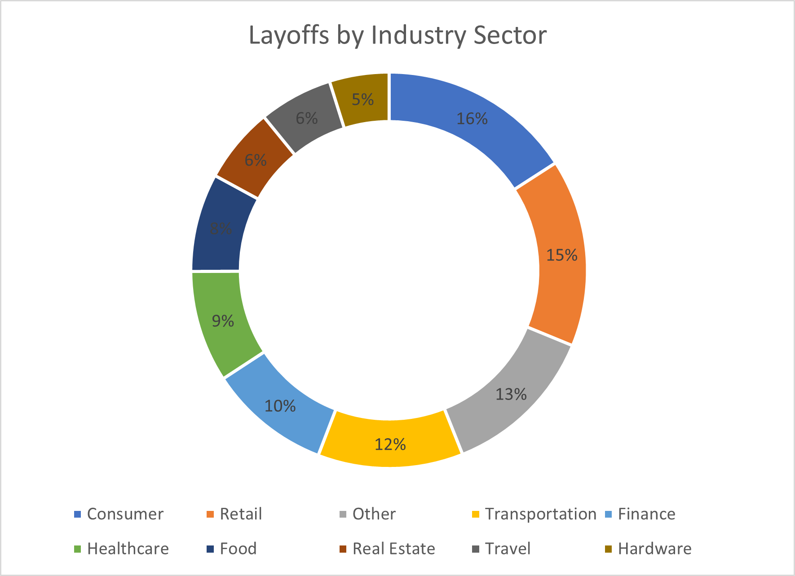
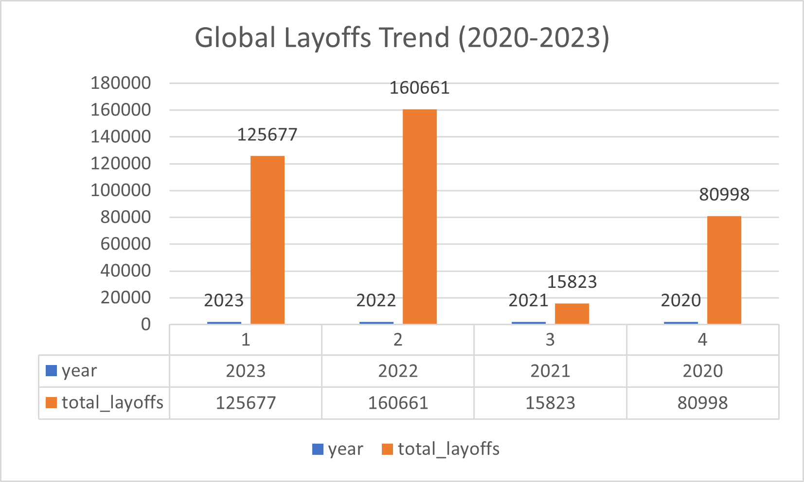
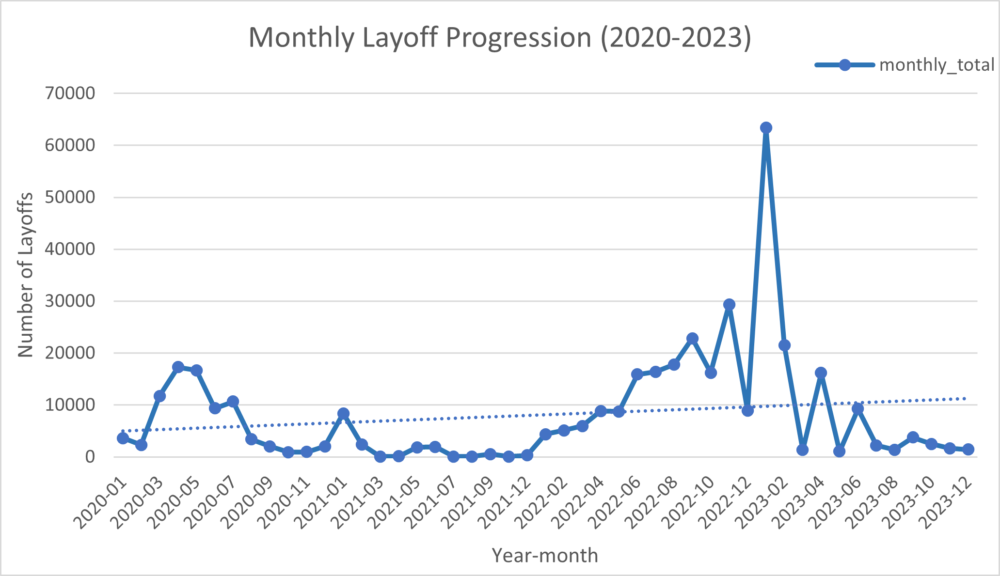
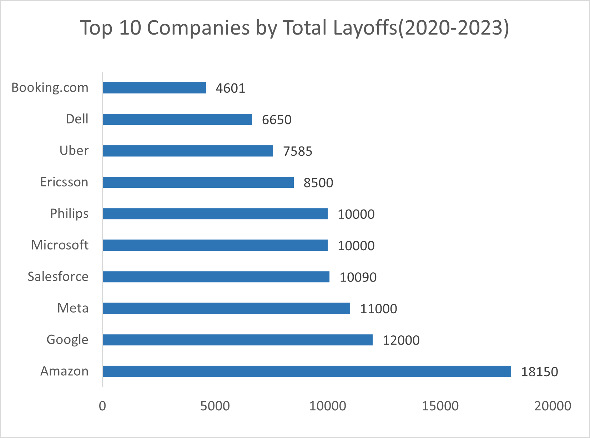

# Global Layoffs Data Analysis (2020-2023) 


**Comprehensive SQL-driven analysis of global layoffs data (2020-2023) revealing industry trends, geographic patterns, and temporal insights through advanced data cleaning and exploratory analysis.**

---

##  Dashboard Overview



*Interactive dashboard showcasing key insights: geographic distribution, industry breakdown, temporal trends, and company-level analysis across 2,362 layoff events from 2020-2023.*

** [View Detailed Findings →](results/key_findings.md)**

---

##  Project Overview

This project performs end-to-end SQL analysis on global layoffs data spanning 2020-2023, containing **2,362 records** across 9 dimensions. Through systematic data cleaning and exploratory analysis, it uncovers critical workforce reduction trends across industries, countries, and companies.

### Key Highlights
-  **2,362 layoff events** analyzed across 4 years
-  **Advanced SQL techniques:** CTEs, Window Functions, Self-JOINs
-  **50+ industries** and **30+ countries** covered
-  **5 interactive visualizations** created
-  **147+ duplicate records** identified and removed

### Dataset Description
| Attribute | Details |
|-----------|---------|
| **Records** | 2,362 layoff events |
| **Time Period** | 2020-2023 |
| **Coverage** | Global (30+ countries) |
| **Industries** | 50+ sectors |

**Columns:** company, location, industry, total_laid_off, percentage_laid_off, date, stage, country, funds_raised_millions

---

##  Technologies Used

**Database:** MySQL 8.0  
**Visualization:** Microsoft Excel  
**Techniques:** Data Cleaning, ETL, Exploratory Data Analysis

**Advanced SQL Features:**
- Common Table Expressions (CTEs)
- Window Functions (`ROW_NUMBER()`, `DENSE_RANK()`, `PARTITION BY`)
- Self-JOINs for data enrichment
- Date manipulation (`STR_TO_DATE()`, `YEAR()`, `SUBSTRING()`)
- String functions (`TRIM()`, pattern matching)
- Aggregate functions (`SUM()`, `MAX()`, `AVG()`, `COUNT()`)

---

##  Project Structure

```
sql-layoffs-analysis/
│
├── README.md                          # Project documentation
│
├── data/
│   ├── layoffs_data.xlsx              # Raw dataset (2,362 records)
│   └── query_results/                 # Exported CSV files from SQL queries
│
├── sql/
│   ├── 01_data_cleaning.sql           # Data cleaning & preprocessing
│   └── 02_exploratory_analysis.sql    # EDA queries & insights
│
├── results/
│   ├── key_findings.md                # Executive summary & insights
│   └── query_outputs.md               # Sample query results with explanations
│
└── visualizations/
    ├── excel_dashboard_full.png       # Complete dashboard
    ├── top_10_companies_chart.png     # Company rankings
    ├── industry_breakdown_chart.png   # Industry distribution
    ├── yearly_trends_chart.png        # Year-over-year trends
    ├── monthly_trends_chart.png       # Monthly progression
    └── country_breakdown_chart.png    # Geographic distribution
```

---

##  Getting Started

### Prerequisites
- MySQL 8.0 or higher
- MySQL Workbench or any SQL client

### Setup Instructions

**Step 1: Clone the repository**
```bash
git clone https://github.com/lalimasingh2004-glitch/sql-layoffs-analysis.git
cd sql-layoffs-analysis
```

**Step 2: Import dataset into MySQL**
```sql
CREATE DATABASE world_layoffs_1;
USE world_layoffs_1;
-- Import layoffs_data.xlsx using MySQL Workbench Table Data Import Wizard
```

**Step 3: Run SQL scripts**
```sql
SOURCE sql/01_data_cleaning.sql;    -- Clean and prepare data
SOURCE sql/02_exploratory_analysis.sql;  -- Run analysis queries
```

---

##  Visualization Breakdown

### 1️. **Geographic Distribution**


**Key Insight:** United States dominates with **256,559 layoffs (50.8%)**, followed by India (35,993) and Netherlands (17,220). Clear concentration in tech hubs.

---

### 2️. **Industry Impact Analysis**


**Key Insight:** Consumer (16%), Retail (15%), and Other (13%) sectors most affected. Technology sector heavily impacted despite being distributed across categories.

---

### 3️. **Year-over-Year Trends**


**Key Insight:** **2022 was peak year** (160,661 layoffs), representing 40% increase from 2023. Shows correlation with tech market corrections.

---

### 4️. **Monthly Progression Timeline**


**Key Insight:** Massive spike in **November 2022** (64,000+ layoffs). Clear seasonal patterns with Q1 and Q4 showing higher activity. Dotted trend line shows overall increase from 2020-2022, then decline in 2023.

---

### 5️. **Top Companies Affected**


**Key Insight:** Amazon leads with **18,150 layoffs**, followed by Google (12,000) and Meta (11,000). Large tech companies executed significant workforce reductions during market downturn.

---

##  Key Findings Summary

### Quick Stats
- **Total Layoffs:** 505,000+ employees
- **Companies Affected:** 1,200+
- **Peak Period:** November 2022 (64,000 layoffs)
- **Most Affected Sector:** Consumer & Retail (31% combined)
- **Geographic Leader:** United States (50.8% of global layoffs)

### Critical Insights
1. **2022-2023 Crisis:** Peak layoff period correlating with tech market corrections
2. **Q1 & Q4 Seasonality:** Historical high-risk periods for workforce reductions
3. **Big Tech Impact:** Top 10 companies account for 100K+ layoffs
4. **U.S. Concentration:** Over half of global layoffs occurred in United States
5. **100% Layoffs:** Multiple complete company shutdowns identified

** [Read Full Analysis →](results/key_findings.md)**

---

##  Analysis Workflow

### Phase 1: Data Cleaning
- Removed **147+ duplicates** using `ROW_NUMBER()` window function
- Standardized **company names**, **industry categories**, and **country names**
- Converted date strings to proper DATE format
- Filled missing industry values using self-JOINs
- Removed records with NULL layoff data

### Phase 2: Exploratory Data Analysis
Answered key business questions:
- Which companies had the most layoffs?
- Which industries were hit hardest?
- What are the geographic patterns?
- How did layoffs trend over time?
- What seasonal patterns exist?

** [View Query Results →](results/query_outputs.md)**

---

##  SQL Skills Demonstrated

 **Data Cleaning Pipeline** - Systematic approach to data quality  
 **Complex CTEs** - Multi-level nested queries for rankings  
 **Window Functions** - Advanced analytical operations  
 **Self-JOINs** - Intelligent data enrichment  
 **Temporal Analysis** - Date manipulation and trend identification  
 **Aggregations** - Statistical summaries across dimensions

---

##  Business Recommendations

**For Companies:**
- Prepare for Q1/Q4 workforce adjustments (historical high-risk periods)
- Monitor tech sector volatility as leading indicator
- Post-IPO companies should anticipate market-driven reductions

**For Job Seekers:**
- Diversify industry exposure to reduce risk
- Consider geographic flexibility (non-U.S. markets more stable)
- Monitor company funding announcements as stability indicators

**For Investors:**
- Late-stage companies show higher layoff resilience
- Industry diversification critical for portfolio risk management
- Market downturns trigger concentrated layoff events

---

##  Contributing

Contributions welcome! Areas for improvement:
- Additional analytical queries
- Enhanced visualizations
- Predictive modeling
- Real-time data integration

---

##  Author

**Lalima Singh**

 Email: lalimasingh2004@gmail.com  
 LinkedIn: [Lalima Singh](https://linkedin.com/in/yourprofile)  
 GitHub: [@lalimasingh2004-glitch](https://github.com/lalimasingh2004-glitch)


**Last Updated:** December 2024 | **Version:** 1.0.0
